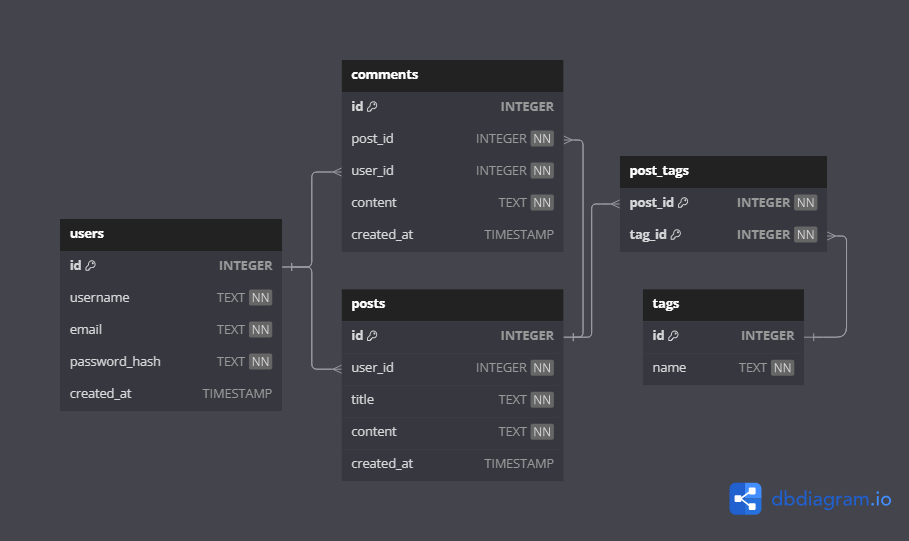
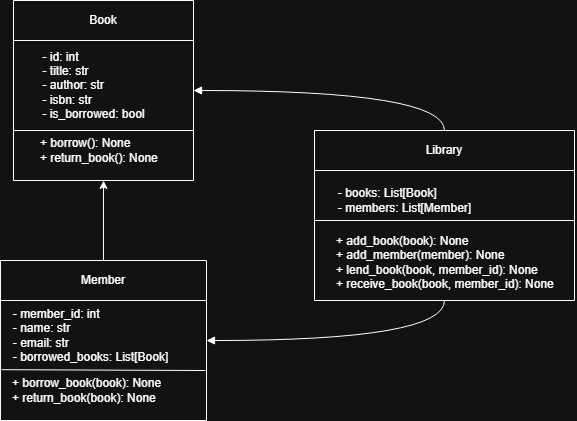

# Backend Dev Mid Test

Este repositorio contiene la solución a la prueba técnica para **Backend Developer Mid** de **Jikkosoft**.

---

## ✍️ Descripción General

La prueba se divide en tres ejercicios principales:

1. **Diseño de una base de datos para una plataforma de blogs**
2. **Implementación de una función para encontrar dos números que sumen un objetivo**
3. **Desarrollo de un sistema de gestión de biblioteca con programación orientada a objetos**

---

## ⚙️ Configuración del Proyecto

### Requisitos

- Python 3.8 o superior
- Git Bash / Terminal compatible con `bash`
- Acceso a internet para instalar dependencias

### Instrucciones de uso

```bash
# Clonar el repositorio
git clone https://github.com/jewar21/backend-dev-mid-test.git
cd backend-dev-mid-test

# Ejecutar el script de setup
bash setup_env.sh
```

Esto creará un entorno virtual, lo activará y descargará las dependencias.

---

## 📁 Estructura del Proyecto

```
backend-dev-mid-test/
├── database/                          # Punto 1: Base de datos para blog
│   ├── blog_platform.png              # Diagrama ER
│   ├── blog_platform.sql
│   └── models.py                      # Modelos SQLAlchemy
├── library_system/                    # Punto 3: Sistema de biblioteca modular y persistente
│   ├── persistence
│   │   ├── __init__.py
│   │   ├── books.json                 # Base de datos simulada en formato JSON
│   │   └── persistence.py             # Funciones para guardar y cargar libros
│   ├── test
│   │   ├── __init__.py
│   │   └── test_library.py            # Pruebas con `unittest`
│   ├── uml/
│   │   └── library_uml.drawio.png     # Imagen del diagrama `UML`
│   ├── __init__.py
│   ├── cli_main.py                    # CLI con argparse para préstamo, devolución y listado
│   ├── main.py                        # Simulación funcional básica
│   └── models.py                      # Clases Book, Member y Library
├── target_sum/                        # Punto 2: Algoritmo para encontrar dos números que suman un target
│   ├── main.py                        # Ejecución interactiva desde consola
│   ├── target_sum.py                  # Contiene la función `find_two_sum`
│   └── test_target_sum.py             # Pruebas unitarias con `unittest`
├── .gitignore                         # Exclusiones de entorno virtual y cachés
├── README.md                          # Documentación completa del proyecto
├── requirements.txt                   
└── setup_env.sh                       # Script de configuración del entorno
```

---

## 🧠 Punto 1: Base de Datos de Blog

Se diseñó una base de datos relacional que permite:
- Registrar usuarios
- Publicar entradas de blog
- Comentar en entradas
- Etiquetar publicaciones

### Diagrama ER



### Archivos
- `blog_platform.sql`: script SQL para crear la base de datos
- `models.py`: versión en SQLAlchemy de los modelos

---

## 🧮 Punto 2: Función para encontrar dos números que suman un entero destino

Se desarrolló una función eficiente que identifica los índices de dos números dentro de una lista que suman un número entero destino (target) ingresado por el usuario.

### Ejecución del programa

```bash
python blog_target_sum/main.py
```

### Ejecución de pruebas

```bash
python -m unittest blog_target_sum/test_target_sum.py
```

La función está probada contra diferentes casos, incluyendo listas vacías, sin solución, con números negativos y con múltiples soluciones posibles.

---

## 📚 Punto 3: Sistema de Gestión de Biblioteca

Este módulo implementa un sistema sencillo de biblioteca basado en clases POO. El diseño está compuesto por tres clases principales:

- `Book`: representa un libro con atributos básicos e información de préstamo
- `Member`: representa un usuario registrado en la biblioteca
- `Library`: gestiona la colección de libros y los miembros, y permite prestar y recibir libros

### Diagrama de Clases UML

El siguiente diagrama muestra la estructura lógica del sistema:



### Características implementadas

- Registro de libros y miembros
- Préstamo de libros con validación de disponibilidad
- Devolución de libros
- Seguimiento de libros prestados por cada miembro

---

## 💾 Persistencia con JSON

A partir del Punto 3 se implementó una capa de persistencia para que los libros puedan mantenerse entre ejecuciones del sistema.

### Estructura JSON de libros

```json
{
  "books": [
    {
      "book_id": 1,
      "title": "1984",
      "author": "George Orwell",
      "isbn": "9780451524935",
      "is_borrowed": false
    }
  ]
}
```

### Funcionalidad
- Los libros se cargan automáticamente desde `library_system/persistence/books.json`
- Cada vez que se presta o devuelve un libro, se guarda el estado actualizado en el archivo JSON

---

## ✅ Tests unitarios

Se implementaron pruebas automáticas con `unittest` en el archivo:

```bash
library_system/test/test_library.py
```

### ¿Qué se prueba?
- Préstamo de libros
- Devoluciones
- Restricciones de préstamo doble
- Miembros y libros inexistentes

### ¿Cómo ejecutarlo?

Desde la raíz del proyecto:

```bash
python -m library_system.test.test_library
```

---

## 🧪 CLI Interactivo con Argumentos

El sistema incluye una interfaz de línea de comandos (CLI) usando `argparse`, ubicada en `library_system/cli_main.py`.

### Comandos disponibles:

```bash
python -m library_system.cli_main --list
python -m library_system.cli_main --lend 1 --member 101
python -m library_system.cli_main --return_book 1 --member 101
```

### ¿Qué hace?

- Permite listar libros disponibles y prestados
- Prestar libros a miembros existentes
- Registrar devoluciones

> La persistencia se mantiene tras cada acción gracias al uso de JSON.